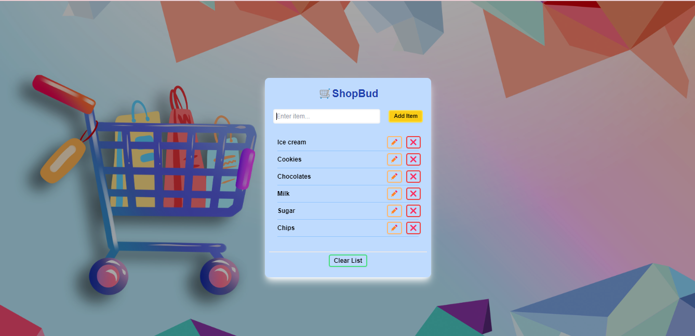

# ShopBud

ShopBud is a sleek and intuitive shopping companion app created using Vite. With ShopBud, users can easily manage their shopping lists, including adding new items, editing existing entries, and deleting items they no longer need. Stay organized and make your shopping experience smoother with ShopBud.

## Features

- **Add Items:** Quickly add items to your shopping list with a user-friendly interface.
- **Edit Items:** Modify your shopping list items effortlessly to keep it up to date.
- **Delete Items:** Remove items from your list with a simple tap to ensure it remains relevant.

## Screenshots



## Demo

https://seenj-shopbud.netlify.app/

## Installation

To get started with ShopBud, follow these steps:

1. **Clone the repository:**
   ```bash
   git clone https://github.com/seenjey07/ShopBud.git
   ```
2. **Navigate to the project directory:**

   ```bash
   cd shopbud
   ```

3. **Install dependencies:**

   ```bash
   npm install
   ```

4. **Start the development server:**

   ```bash
   npm run dev
   ```

5. Open your browser and go to `http://localhost:3000` to view the app.

## Technologies Used

- **Vite:** A fast build tool for modern web projects.
- **React:** A JavaScript library for building user interfaces.
- **Tailwind CSS:** A utility-first CSS framework.
- **JavaScript:** A high-level, often just-in-time compiled, and multi-paradigm programming language.

## Contributing

Contributions are welcome! If you have any suggestions, bug reports, or feature requests, please open an issue or submit a pull request.

1. **Fork the repository.**
2. **Create a new branch:**
   ```bash
   git checkout -b feature/YourFeatureName
   ```
3. **Make your changes.**
4. **Commit your changes:**
   ```bash
   git commit -m 'Add some feature'
   ```
5. **Push to the branch:**
   ```bash
   git push origin feature/YourFeatureName
   ```
6. **Open a pull request.**

## License

This project is licensed under the MIT License - see the [LICENSE](LICENSE) file for details.

## Contact

For any inquiries, feel free to reach out:

- **Christine Joy Tauy**
- **Email:** chrosales07@gmail.com
- **GitHub:** [seenjey07](https://github.com/seenjey07)

**Special thanks to DevDotCom (Youtube and TikTok) whose works served as my guide in making this app. 🫡
